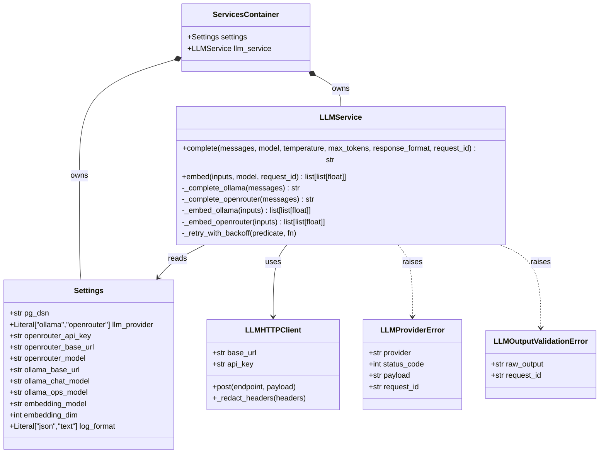

# Task 1 — Foundations (REASONS Canvas, trainee edition)

> **Trainee-edition posture.** This is the canvas you receive on
> Day 1 of Week 1. It is intentionally **under-specified** in places —
> the missing detail is the work you are expected to do during your
> analysis-step + canvas-completion practice. The destination state
> for this task lives in `Task_1_Foundations.md`; do not read that
> file until your mentor signs off this canvas. Sections you must
> complete before generating code are marked **TODO(trainee)**.
>
> **Maps to:** Learning Plan Week 1 — *Python Foundations & Service Abstractions*.
> **Depends on:** `Task_0_Environment.md` (already complete and identical
> to the destination version).
> **Unblocks:** `Task_2_Ingestion.trainee.md`, `Task_3_Orchestration.trainee.md`.

---

## Requirements

### Analysis context

**Domain keywords scanned:** LLMService, OpenRouter, Ollama,
embeddings, settings, request_id, structured logging, retries.
**Existing artifacts:** `.env.example`, the `app/` skeleton from
Task 0. **Prior tasks read:** Task 0 (env keys, healthz, settings
stub).

**Strategic direction:** one provider-agnostic facade over chat +
embeddings, configured by `Settings`. Retries and structured-output
parsing live behind the facade, never in the caller. Errors are
typed so callers can decide policy without sniffing message
strings.

**Risks noticed.**

1. **Provider response-shape drift.** Ollama and OpenRouter return
   different JSON shapes for chat completions (e.g. Ollama nests
   the message at `response["message"]["content"]` while OpenRouter
   uses `choices[0]["message"]["content"]`) and for embeddings
   (Ollama returns `response["embedding"]` for a single input;
   OpenRouter returns `data[i]["embedding"]` for a batch). If the
   unwrapping logic is scattered across callers, switching
   providers or upgrading a provider API would require hunting down
   every unwrapping site.
   *Mitigation:* `LLMService` uses an explicit provider switch —
   `if self._settings.llm_provider == "ollama": ... elif
   self._settings.llm_provider == "openrouter": ...` — inside
   the private methods `_complete_ollama`, `_complete_openrouter`,
   `_embed_ollama`, and `_embed_openrouter`. The public `complete()`
   and `embed()` methods dispatch to the correct private method
   based on `llm_provider` and return a uniform Python type (`str`
   for complete, `list[list[float]]` for embed). Callers never
   touch raw response dicts. When a provider deprecates an endpoint
   or changes its shape in a future version, the blast radius is
   confined to one private method.

2. **Retry-induced cost amplification.** With exponential backoff
   up to 3 attempts, a single user request can trigger 3 paid
   OpenRouter calls even when the first two succeed but arrive
   after the httpx timeout. This multiplies the per-request token
   cost without the user receiving a faster answer.
   *Mitigation:* The retry predicate is narrowed to *transient*
   failures only — HTTP 5xx, `httpx.TimeoutException`, and
   `httpx.RequestError` (connection drop). HTTP 4xx responses
   (auth failure, bad request shape) are never retried because
   they will not succeed on a subsequent attempt. The final
   `LLMProviderError` carries the upstream status code so the
   caller can distinguish a 429 rate-limit from a genuine backend
   outage.

3. **Secret leakage in logs and traces.** The `OPENROUTER_API_KEY`
   travels as an HTTP `Authorization: Bearer <key>` header. If
   the httpx layer or the structured logger serialises the full
   request dict (headers + body) at DEBUG level, the key leaks
   into disk logs, trace exporters, and error payloads.
   *Mitigation:* `LLMHTTPClient` applies a redaction step
   *before* any log call — it clones the outgoing headers dict,
   replaces the `Authorization` value with `"REDACTED"`, and
   passes the redacted copy to the logger. The raw key never
   appears in `loguru` / `structlog` output, LangSmith trace
   metadata, or `LLMProviderError.payload`. The `Settings` class
   also marks `openrouter_api_key` with `repr=False` so accidental
   `print(settings)` does not expose it.

### Why this task exists

The agent needs **one place** that knows how to talk to LLMs and
**one place** that knows how to read configuration. Without these
abstractions, every retrieval/synthesis/evaluation script would
couple itself directly to OpenRouter or Ollama, which makes the
codebase impossible to test, reason about, or swap providers in.
Task 1 also introduces the structured-logging contract that
everything downstream depends on for observability and request
correlation.

### Acceptance criteria (Given/When/Then)

These are the contract; do not soften them.

- **Given** valid env variables in `.env`,
  **when** `python -c "from app.core.config import get_settings;
  print(get_settings().openrouter_model)"` runs,
  **then** it prints the configured model name without raising.
- **Given** `LLM_PROVIDER=openrouter` and a missing
  `OPENROUTER_API_KEY`,
  **when** `get_settings()` is called,
  **then** Pydantic raises a `ValueError` from the `model_validator`
  naming the missing key. (Under `LLM_PROVIDER=ollama` the key is
  optional.)
- **Given** an `LLMService` instance configured for OpenRouter and a
  test that mocks the underlying `httpx.AsyncClient`,
  **when** `await llm.complete(messages=[{"role":"user","content":"hi"}])`
  is invoked,
  **then** the mocked HTTP layer receives a POST to
  `https://openrouter.ai/api/v1/chat/completions`.
- **Given** an `LLMService` instance configured for Ollama and a
  test that mocks the underlying `httpx.AsyncClient`,
  **when** `await llm.complete(...)` is invoked,
  **then** the mocked HTTP layer receives a POST to
  `http://localhost:11434/api/chat` and unwraps `message.content`.
- **Given** a transient HTTP 5xx response,
  **when** `LLMService.complete` runs,
  **then** the call retries with exponential backoff up to **3
  attempts** before raising `LLMProviderError`.
- **Given** any service or LangGraph node logs a structured event,
  **when** `LOG_FORMAT=json`,
  **then** every record contains at minimum `timestamp`, `level`,
  `request_id`, `event`, and (where applicable) `duration_ms`.

---

## Entities

| Entity | Spec |
|---|---|
| `Settings` | Pydantic Settings model for the env keys listed in Root Architecture. |
| `LLMService` | Provider-agnostic facade. Two methods: `complete` (chat) and `embed` (batch embeddings). |
| `LLMProviderError` | Custom exception. Carries `provider`, `status_code`, `payload`, `request_id`. |
| `LLMOutputValidationError` | Custom exception raised when a structured-output parse fails. (Used in Task 4 but defined here.) |
| `request_id` | UUIDv4. Generated by middleware. Threaded into every log line. |
| `ServicesContainer` | Plain dataclass that bundles `Settings` + `LLMService`. Constructed once in `app/api/main.py` lifespan. |

### Class diagram



---

## Approach

### Design decisions

1. **Single `Settings` class** with a Pydantic `model_validator`
   that raises early when required env keys are missing. No
   per-module env reads scattered through the codebase.
2. **One `LLMService` facade** with two methods (`complete`,
   `embed`). Provider differences (Ollama vs OpenRouter) live
   *inside* the service; callers never see them.
3. **A thin HTTP layer** (`LLMHTTPClient` wrapping
   `httpx.AsyncClient`) so tests can swap in `httpx.MockTransport`
   without monkey-patching the whole network stack.
4. **Typed exceptions** (`LLMProviderError`,
   `LLMOutputValidationError`) so callers branch on type, not on
   error-string parsing.
5. **Structured logging via ContextVar.** A `request_id`
   middleware binds the id once at API ingress; loggers read from
   the ContextVar. No threading the id through every function
   signature.

### Trade-offs accepted

1. **We accept up to 7 seconds of worst-case retry latency (1 s + 2 s + 4 s with exponential backoff) because bounded retries keep the agent resilient to transient provider outages**, even though interactive `/agent/query` callers will experience a perceptible delay before receiving an error response. The alternative — no retries — would fail on the first network hiccup and make the agent feel brittle during demos and evaluation runs.

2. **We accept verbose structured-log output (multi-line JSON records per request, each carrying `timestamp`, `level`, `request_id`, `node_name`, `event`, and `duration_ms`) because every field is necessary to correlate failures across the async call chain during post-mortem analysis**, even though reading raw JSON logs during local development is noisy compared to plain `print()` statements. The `LOG_FORMAT=text` key-value mode partially mitigates this for interactive debugging.

3. **We accept that `Settings` fails fast at construction time when a conditionally-required env var is missing (e.g. `OPENROUTER_API_KEY` under `LLM_PROVIDER=openrouter`) because catching misconfiguration at import time prevents silent fallback to a wrong provider or an unauthenticated request that would fail deep inside the call stack with a cryptic HTTP 401**, even though this means a developer who forgot to export one variable cannot even start the app to inspect other parts of the system.

4. **We accept that a single structured-output parse failure raises `LLMOutputValidationError` without any best-effort field repair (e.g. lowercasing a misspelled enum value, defaulting a missing field, or stripping markdown fences around the JSON blob) because every parse failure is a signal that the corresponding Jinja2 prompt template needs tightening**, even though in practice many malformed responses are trivially salvageable with a few lines of defensive code. Salvaging them would mask prompt weaknesses that the evaluation pipeline (Task 5) is designed to surface.

---

## Structure

### File layout

```
app/
├── core/
│   ├── config.py             # Settings + get_settings()
│   ├── logging.py            # configure_logging + bind_request_id
│   ├── exceptions.py         # LLMProviderError, LLMOutputValidationError
│   └── services_container.py # ServicesContainer dataclass
├── services/
│   ├── llm_client.py         # LLMHTTPClient (httpx wrapper)
│   └── llm_service.py        # LLMService (provider switch)
└── api/
    └── main.py               # lifespan wires the container; /readyz added here
```

### Method signatures (the contract)

```python
# app/core/config.py
class Settings(BaseSettings):
    pg_dsn: str
    llm_provider: Literal["ollama", "openrouter"] = "ollama"
    log_format: Literal["json", "text"] = "text"
    # Conditional, see Acceptance Criteria
    openrouter_api_key: str | None = None
    openrouter_base_url: str = "https://openrouter.ai/api/v1"
    openrouter_model: str = "gpt-4.1-mini"
    # Defaulted
    ollama_base_url: str = "http://localhost:11434"
    ollama_chat_model: str = "gemma3:27b"
    ollama_ops_model: str = "qwen3.5:4b"
    embedding_model: str = "nomic-embed-text"
    embedding_dim: int = 768

@lru_cache
def get_settings() -> Settings: ...

# app/services/llm_service.py
class LLMService:
    def __init__(self, settings: Settings, http_client: LLMHTTPClient) -> None: ...
    async def complete(
        self,
        messages: list[dict[str, str]],
        *,
        model: str | None = None,
        temperature: float = 0.0,
        max_tokens: int | None = None,
        response_format: str | None = None,
        request_id: str | None = None,
    ) -> str: ...
    async def embed(
        self,
        inputs: list[str],
        *,
        model: str | None = None,
        request_id: str | None = None,
    ) -> list[list[float]]: ...
```

---

## Operations (strict execution order)

> The first 4 steps are pinned. Steps 5+ are **TODO(trainee)** —
> derive them from the Acceptance Criteria + your Approach. Your
> mentor will sign off the full Operations list before you generate
> code.

1. **Replace the Task 0 `Settings` stub** in `app/core/config.py`
   with the full Pydantic Settings model from *Structure*. Add the
   `@lru_cache` factory.
2. **Implement `app/core/logging.py`** with `configure_logging` and
   `bind_request_id`. Read formats from `Settings.log_format`.
3. **Implement `app/core/exceptions.py`** with the two exception
   classes. They must serialise their `payload` safely if printed.
4. **Implement `app/services/llm_client.py`** wrapping
   `httpx.AsyncClient`. The constructor accepts `base_url`, `api_key`,
   and an optional `transport` so tests can inject
   `httpx.MockTransport`.

5. **implement `LLMService`** for both providers.
   For the retry predicate, define a private `_is_transient(status_code, exception) -> bool` to handle different kinds of errors.
   For `complete`, use the chat endpoints already pinned in the
   acceptance criteria. For `embed`, the canonical paths are
   `embeddings` (OpenRouter) and `api/embeddings` (Ollama, one
   vector per call — you'll write a small client-side batch
   loop). Document any deviations in your Trade-offs.
6. **wire `ServicesContainer` into `app/api/main.py`
   lifespan and add `/readyz`.** While you are in `main.py`, add
   the request-id middleware: read an incoming `X-Request-Id`
   header if present, otherwise generate a UUIDv4; bind it via
   `bind_request_id`; and set `X-Request-Id` on the outgoing
   response so downstream services can correlate. The HTTP
   header is the public contract; the ContextVar is the in-process
   carrier.
7. **write tests**: `test_config.py`,
   `test_llm_service.py` (with `httpx.MockTransport`),
   `test_logging.py`. Aim for 100% coverage of the new modules.
8. **Update `README.md`** with a *Local development* section that
   covers `poetry install`, the canonical Ollama path (`ollama pull
   …`), and how to run `pytest` + `mypy --strict`. The destination
   README's *Local development* section is a useful reference *after*
   you draft yours.
9. **Verify** by running `pytest`, `ruff check .`, `mypy --strict
   --explicit-package-bases app data_pipelines`, and
   `./scripts/smoke.sh` (the script exists from Task 3+; until then,
   manually `curl /healthz` and `curl /readyz`).

---

## Norms

- Constructor-based DI only. No global singletons.
- All new functions are type-hinted; `mypy --strict` passes.
- Async by default for I/O paths.
- Pydantic v2 for all DTOs.
- Structured logging carries `request_id` on every record.
- Public service methods (`complete`, `embed`) declare
  `request_id: str | None = None`. The default `None` is
  resolved to the ContextVar's bound value at log time, never
  logged as `null`. Safeguard 4 below forbids *bypassing* the
  ContextVar by inventing ad-hoc kwargs; it does NOT forbid the
  documented `request_id` parameter.
- Truncate prompts in logs at 500 chars with a `_truncated: true`
  flag.

---

## Safeguards

1. **Do not import `os.getenv` outside `app/core/config.py`.**
   Every other module reads from a `Settings` instance.
2. **Do not silently swallow LLM errors.** Retries are bounded and
   the final failure raises `LLMProviderError` with the upstream
   payload.
3. **Do not log the `OPENROUTER_API_KEY`** or any header that
   contains it. Redact at the logging layer.
4. **Do not bypass `bind_request_id`** by passing `request_id`
   through arbitrary kwargs. The ContextVar is the canonical
   carrier.
5. **Do not commit a real API key.** `.env` is gitignored;
   `.env.example` ships placeholders only.

---

> **Spec drift watch.** When your implementation diverges from this
> canvas (e.g. you discover the LLM client needs a `timeout`
> parameter that wasn't documented), edit this canvas FIRST in the
> same PR — that's the project's *SPDD discipline* norm. A code-only
> diff with stale specs is a review block.
